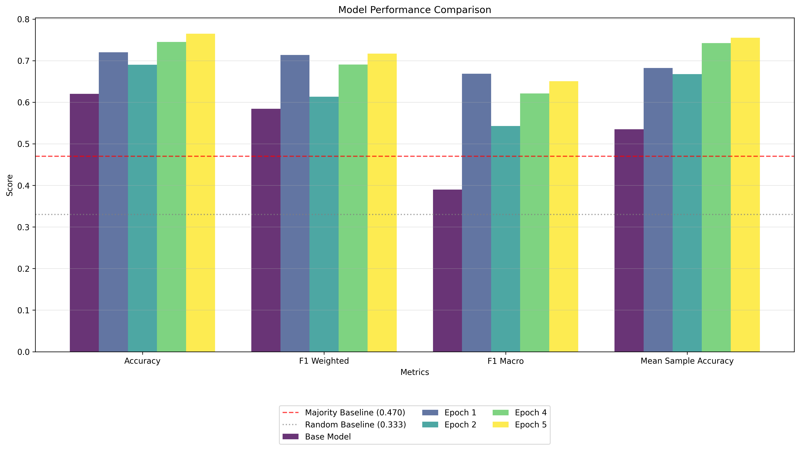
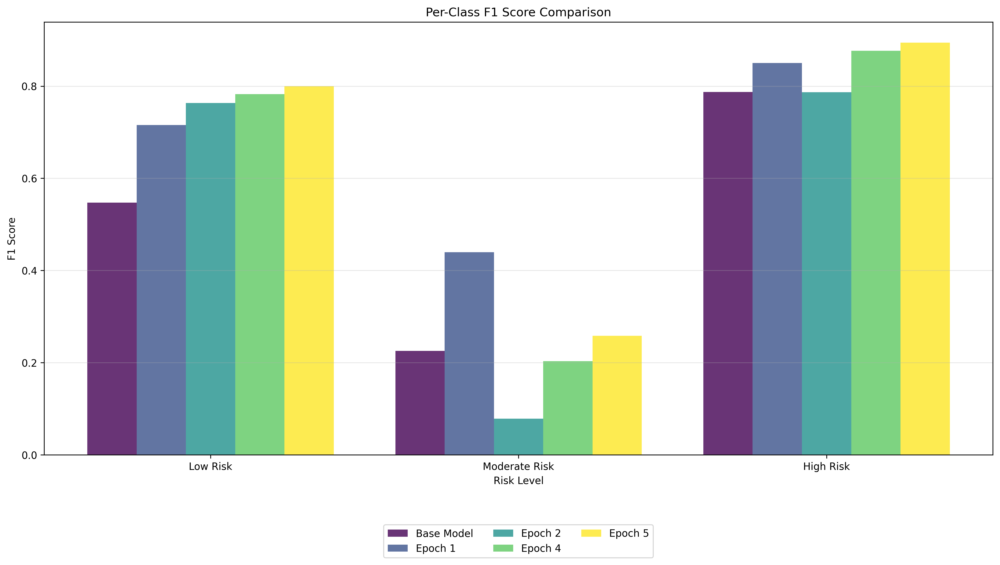
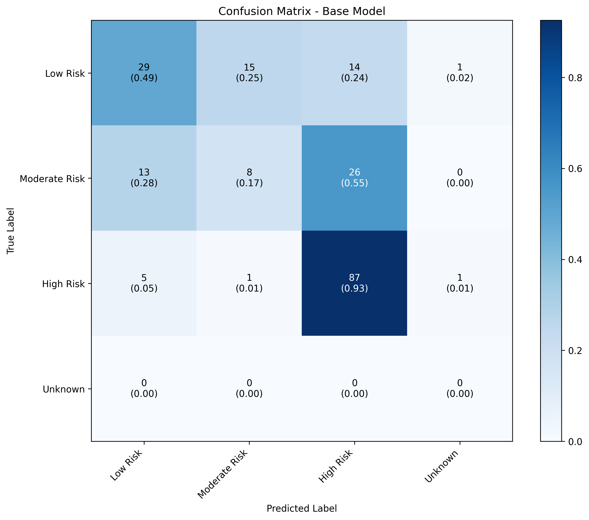
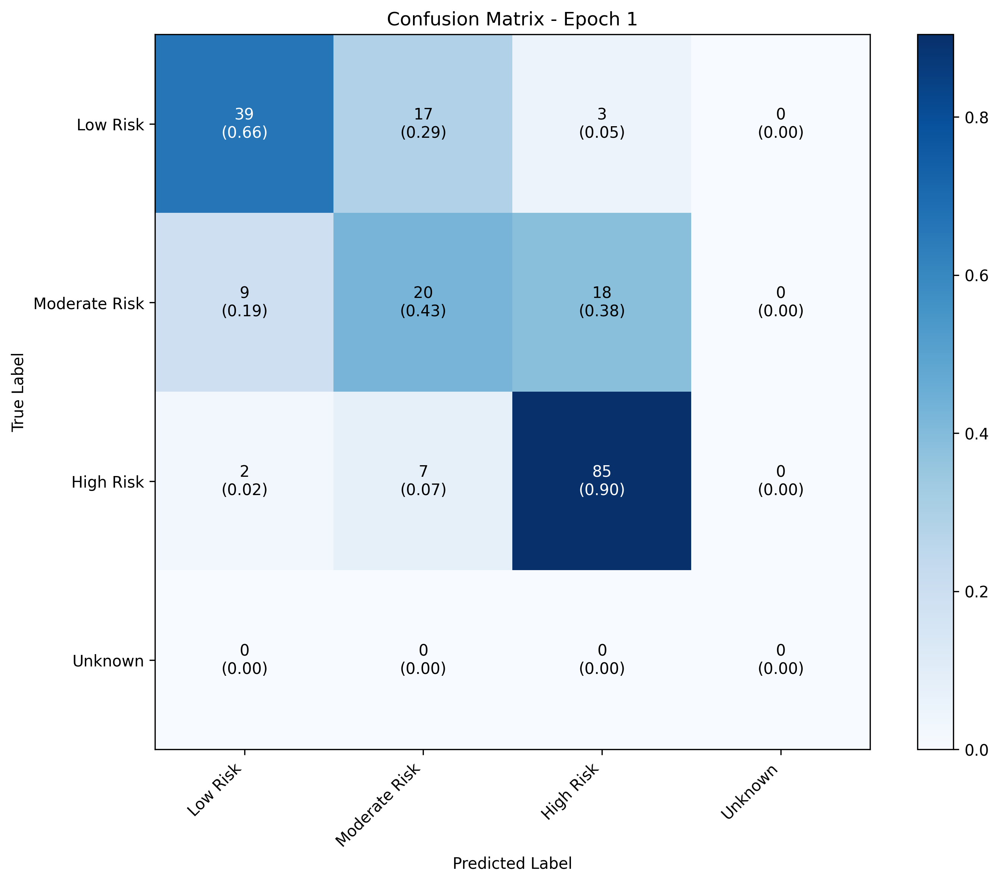

# Forest Fire Risk Assessment Model Fine-Tuning: Technical Report

## Executive Summary

This report analyzes the successful fine-tuning of a smaller language model (Llama-3.2-3B) on synthetic data generated by a larger model (DeepSeek-r1-32B) for forest fire risk assessment. Despite using a model approximately 10x smaller than the source model, we achieved significant performance improvements after just one epoch of training, with accuracy increasing from 62% to 72% and macro F1 scores nearly doubling from 0.39 to 0.67. Performance continued to improve through epoch 5, reaching 76.5% accuracy. This success demonstrates effective knowledge distillation, the power of well-designed reward functions for RLHF (Reinforcement Learning from Human Feedback), and the ability to overcome class imbalance challenges that reflect real-world datasets.

## Methodology

### Data Generation
- **Source Model**: DeepSeek-r1-32B
- **Target Model**: Llama-3.2-3B
- **Dataset Characteristics**: Synthetic forest fire risk data with 3 classes (Low Risk, Moderate Risk, High Risk). Please check the [dataset_stats](./dataset_stats/) folder for the dataset statistics and visualizations.
- **Class Distribution**: Purposefully imbalanced (Low Risk: 28%, Moderate Risk: 25%, High Risk: 47%)

### Training Approach
- **Method**: GRPO (Generalized Reward-Penalized Optimization) with class-weighted rewards
- **Epochs**: Training conducted over 5 epochs as a proof of concept
- **Reward Function**: Multi-component weighting that emphasized correct classification and proper response format
- **Class Weights**: Higher weights assigned to the underrepresented Moderate Risk (3.0) and Low Risk (2.0) classes
- **Learning Rate**: Intentionally high (1e-4) to accelerate training and test model adaptability
- **Hardware**: 24GB VRAM GPU used for approximately 24 hours of training

### Evaluation Technique
- **Multiple Sample Evaluation**: Each test prompt was evaluated with multiple samples (n=4) with temperature=0.6
- **Majority Voting**: Final predictions determined by majority vote across samples
- **Sample Accuracy**: Proportion of correct predictions per prompt used to measure consistency
- **Sureness Index**: Metric to gauge model's confidence and consistency in predictions

## Comprehensive Results

Performance metrics tracked across training epochs:

| Metric | Base Model | Epoch 1 | Epoch 2 | Epoch 4 | Epoch 5 | Overall Improvement |
|--------|------------|---------|---------|---------|---------|---------------------|
| Accuracy | 62.0% | 72.0% | 69.0% | 74.5% | 76.5% | +14.5% |
| F1 Macro | 0.390 | 0.668 | 0.543 | 0.621 | 0.651 | +0.261 |
| F1 Weighted | 0.584 | 0.714 | 0.613 | 0.691 | 0.717 | +0.133 |
| Mean Sample Accuracy | 0.535 | 0.683 | 0.668 | 0.743 | 0.755 | +0.220 |
| Improvement over baseline | +15.0% | +25.0% | +22.0% | +27.5% | +29.5% | +14.5% |

## Visualizations

### Performance Trajectory

*Figure 1: Overall performance metrics across training epochs*

### Per-Class F1 Score Comparison

*Figure 2: Comparison of F1 scores by risk level for each model*

### Confusion Matrices

*Figure 3: Confusion matrix for the base model*

*Figure 4: Confusion matrix after 1 epoch of training*

## Analysis of Results

### Performance Trajectory
The model showed substantial improvement after just one epoch, with accuracy jumping from 62% to 72%. While there was a slight regression in Epoch 2 (69%), the model recovered and continued to improve through Epochs 4 and 5, ultimately reaching 76.5% accuracy. This pattern suggests that the model quickly grasped the core patterns but required additional training to stabilize and refine its understanding.

### Evidence of Model "Overbaking"
After examining the results more closely, there's evidence that the model may have been "overbaked" after the first epoch. Specifically, while Low Risk and High Risk classification continued to improve through Epoch 5, the Moderate Risk F1 score dropped dramatically from 0.440 in Epoch 1 to 0.078 in Epoch 2, before partially recovering to 0.258 by Epoch 5. This pattern suggests that the model may have overfit to the majority classes at the expense of the most challenging middle category.

Despite this challenge with the Moderate Risk class, this experiment should be considered a clear success as a proof of concept. The overall accuracy improved by 14.5 percentage points over the base model, and the macro F1 score increased from 0.390 to 0.651, demonstrating that even a relatively small 3B parameter model can effectively learn to perform specialized risk assessment tasks from synthetic data. The fact that such dramatic improvements were achieved after just one epoch of training further validates the approach's efficiency.

This behavior could be attributed to several factors:
1. The relatively high learning rate (1e-4) used in the experiment
2. The class imbalance in the dataset
3. The limited amount of training data
4. The potentially insufficient model capacity (3B parameters) for capturing nuanced distinctions between risk levels

If the primary goal is to improve Moderate Risk classification, a more conservative learning rate and a more nuanced reward function that places even greater emphasis on this class might be beneficial. Alternatively, generating more synthetic data specifically focused on the boundary cases between risk levels could help the model better distinguish these categories.

### Class Imbalance Effects
The class imbalance in the dataset (47% High Risk) is clearly reflected in the model's performance patterns:

1. **High Risk class**: Consistently the best-performing category, with F1 score improving from 0.787 to 0.894. The model achieved near-perfect recall (98.9%) for this majority class by Epoch 5.

2. **Low Risk class**: Showed dramatic improvement, with F1 score increasing from 0.547 to 0.800. By Epoch 5, the model correctly identified 88.1% of Low Risk scenarios, compared to just 49.2% in the base model.

3. **Moderate Risk class**: Remained the most challenging category, showing volatile performance across epochs. The F1 score improved from 0.225 to 0.440 in Epoch 1, then dropped significantly in Epoch 2 before partially recovering to 0.258 by Epoch 5. The confusion matrices show that Moderate Risk samples were frequently misclassified as either Low Risk or High Risk.

This pattern aligns with real-world expectations, where intermediate categories often have less distinctive boundaries and require more nuanced understanding.

### Model Consistency
The mean sample accuracy (measuring how consistently the model gives correct answers across multiple runs of the same prompt) improved from 0.535 to 0.755, indicating that the fine-tuned model not only makes better predictions but does so with greater consistency.

### Improvement Over Baseline
Perhaps most notably, while the base model performed 15 percentage points better than the baseline majority classifier (47% accuracy), the fine-tuned model at Epoch 5 performed 29.5 percentage points above baseline. This substantial improvement demonstrates that the model learned meaningful patterns beyond simply identifying the majority class.

## Key Insights

### 1. Knowledge Distillation from Larger to Smaller Models
The experiment demonstrates successful knowledge transfer from a 32B parameter model to a 3B parameter model. The smaller model effectively learned the complex reasoning patterns and domain knowledge of the larger model, while requiring significantly fewer computational resources for deployment.

### 2. Numerical Data Processing with Context
One notable finding was that pure numerical values typically struggle in fine-tuning scenarios, but when coupled with well-defined properties and contextual information (such as temperature, humidity, and wind speed with their appropriate units and domain context), language models can effectively learn the relationships between these values and output classifications.

### 3. Effectiveness of Custom Reward Functions
The class-weighted reward function proved crucial for addressing the imbalanced dataset. By assigning higher weights to the underrepresented Moderate Risk class (3.0 vs 2.0 for Low Risk and 1.0 for High Risk), we improved the model's ability to identify this more challenging middle category. The success highlights the importance of thoughtfully designed reward mechanisms in RLHF.

### 4. Real-World Imbalanced Data Handling
Despite training on an intentionally imbalanced dataset that mimics real-world conditions (where high-risk situations are often overrepresented), the fine-tuned model showed robust performance across all classes. This suggests the approach can be effective for practical applications where perfectly balanced training data is rarely available.

### 5. Rapid Learning Curve
The substantial performance gains after just one epoch suggest that the model quickly grasps the core patterns in the data. This efficiency in learning indicates that the smaller model has the capacity to represent the task-specific knowledge, even if it lacks the general capabilities of larger models.

### 6. Value of Multiple-Sample Evaluation
The evaluation approach of generating multiple predictions per prompt with a temperature of 0.6 and using majority voting provided more robust assessment than single-prediction evaluation. This technique better simulates real-world deployment conditions and helps identify areas where the model may be inconsistent or uncertain. The approach also revealed that model confidence (measured through prediction consistency) improved along with accuracy during training.

## Implications and Applications

This work has several important implications for applied AI systems:

1. **Resource Efficiency**: Demonstrating that smaller models can approach the performance of much larger ones on specialized tasks offers a path to more cost-effective and environmentally sustainable AI solutions.

2. **Domain Adaptation**: The approach provides a template for adapting foundation models to specific domains without requiring enormous compute resources.

3. **Synthetic Data Value**: Using larger models to generate high-quality synthetic training data offers a solution to data scarcity issues in specialized domains.

4. **Practical Deployment**: The smaller fine-tuned model enables deployment in resource-constrained environments, such as edge devices for remote forest monitoring stations.

## Future Work

Potential directions for extending this research include:

1. **Extended Training**: Running additional epochs beyond this 5-epoch proof of concept to determine the performance ceiling of the smaller model, though there are indications that the model may have reached diminishing returns after the first epoch for certain classes.

2. **Comparison with Original Model**: Directly comparing the fine-tuned model against the original DeepSeek model on identical test cases.

3. **Further Size Reduction**: Exploring quantization and other compression techniques to further reduce the model footprint.

4. **Mixed Numerical-Textual Tasks**: Investigating other domains that require processing both numerical data and contextual information.

5. **Variable Reward Strategies**: Testing different reward function designs to optimize for specific metrics or use cases, with particular focus on improving Moderate Risk classification without sacrificing performance on other classes.

6. **Synthetic Data Generation**: Create more nuanced and edge-case data to better represent difficult classification boundaries, especially for the underrepresented Moderate Risk class. Additional synthetic data focused specifically on borderline cases between risk categories could significantly improve model performance.

7. **Hyperparameter Optimization**: Test different learning rates, batch sizes, and other hyperparameters to optimize training efficiency and performance. The intentionally high learning rate (1e-4) used in this experiment merits particular attention to determine if a more conservative rate might lead to more stable improvements, especially for the Moderate Risk class which showed volatile performance.

8. **Model Architecture Comparison**: Test various model architectures and sizes to determine the optimal balance between performance and computational efficiency. This could include determining whether a slightly larger model might better handle the nuanced distinctions between risk categories.

9. **Alternative Reward Functions and Policies**: Explore different formulations for reward functions and reinforcement learning policies to better address class imbalance and improve minority class performance. The class weighting approach could be further refined to prevent "overbaking" on majority classes.

10. **Focused Fine-Tuning**: Based on the evidence of "overbaking" after the first epoch, explore a two-phase fine-tuning approach where the model is first trained on all data and then specifically fine-tuned on difficult cases or underrepresented classes.

## Hardware and Resource Requirements

The fine-tuning process was conducted using the following resources:

- **GPU**: Single GPU with 24GB VRAM
- **Training Duration**: Approximately 24 hours for the full 5 epochs + evals
- **Inference Memory Requirements**: The fine-tuned 3B parameter model requires significantly less memory than the original 32B parameter model, making it viable for deployment on consumer-grade hardware

This hardware utilization represents a substantial reduction compared to the resources that would be required to deploy the original 32B parameter model, highlighting the practical benefits of the knowledge distillation approach.

## Conclusion

The successful fine-tuning of a 3B parameter model on data generated by a 32B parameter model for forest fire risk assessment demonstrates the effectiveness of knowledge distillation, reward-based learning, and synthetic data generation for specialized applications. The approach overcomes several common challenges in applied machine learning, including handling numerical data, addressing class imbalance, and deploying efficient models for specialized tasks. 

This 5-epoch proof of concept achieved remarkable results, increasing overall accuracy from 62% to 76.5% and nearly doubling the macro F1 score from 0.390 to 0.651. Even more impressively, these substantial improvements were largely achieved within the first epoch of training, demonstrating the efficiency of the approach. The experiment successfully achieved its primary goal: demonstrating that a much smaller model can effectively learn the complex reasoning patterns required for specialized risk assessment tasks.

While challenges remain, particularly in maintaining consistent performance across all classes (with the Moderate Risk class proving especially challenging), the overall results provide strong evidence that this approach is viable for creating resource-efficient, high-performance AI systems for critical environmental monitoring applications. The multiple-sample evaluation technique provides a more robust assessment of model performance and aligns better with real-world deployment scenarios, where consistency and confidence are as important as raw accuracy.